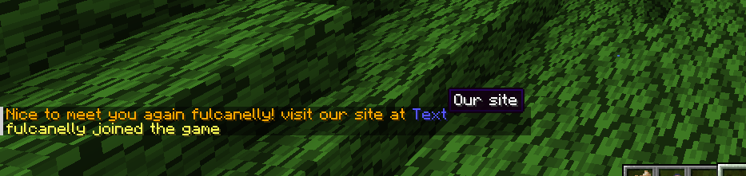
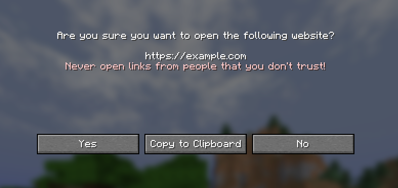

# LightChatWelcomer 


Simple Minecraft plugin to display custom join messages

you can specify colorful message on first or latter joins for player in config 

# Configuration Example

```yml

# plugins/LightChatWelcomer/config.yml
first-join-message: "&red&Welcome to the server! %player%, look to [&blue&Hello](https://example.com Click here)"

welcome-back-message: "&yellow&Welcome back to the server! You were last seen on %lastseen%"

```

# Variables

- `%player%` variable to get user name
- `%lastseen%` to get formatted date of user last login (only avaliable in `welcome-back-message`)

# Colors

Нou can specify text color in few ways:

```
&6Text    # gold color
```

or by color name

```
&gold&Text 
```

- Full color list: https://minecraft.fandom.com/wiki/Formatting_codes 


# Links

You can add clickable links like:

```
[Text](blue https://example.com Hover message)                             
```





or run commands on text click

```
[To get help - click here](/help)                             
```


- For advanced formatting take a look at https://github.com/Phoenix616/MineDown

